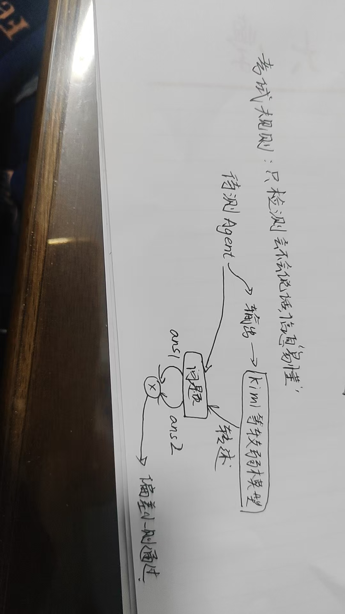
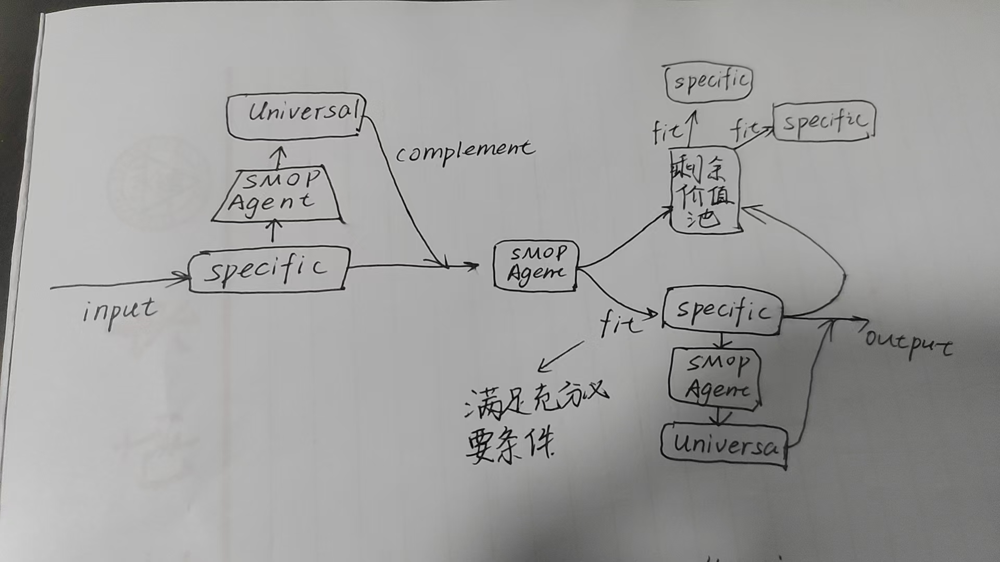

# 🌐 SOMP: The Agent Unified Market

[](LICENSE)
[](#)
[](#)

> **"MCP is just a static socket. SOMP is a dynamic neural link."**
>
> 传统的 MCP (Model Context Protocol) 仍停留在硬编码的接口适配阶段，而 **SOMP (Standard Output Makes Perfect)** 通过定义“语义准入标准”，实现了 Agent 之间真正的、无入侵的思想互联。

---

## 🚀 核心宣言：为什么 SOMP 远强于 MCP？

| 特性 | MCP (Model Context Protocol) | **SOMP (Our Approach)** |
| :--- | :--- | :--- |
| **接入成本** | **沉重**：开发者需手动编写繁琐的适配器 | **零接入**：完全无入侵，适配所有原生输出 |
| **智能深度** | **低**：仅限于结构化工具调用 | **极高**：支持异构模型间的“语义对齐” |
| **质量保证** | **无**：任由模型输出废话或幻觉 | **严苛**：5% 错误率动态淘汰制 |
| **协作方式** | **静态连通**：需预先定义输入输出 | **动态拟合**：自动化 Agent 实时“焊接”协议 |
| **架构哲学** | 静态标准协议 | **自进化生态（生存竞赛）** |

---

## 🧠 SOMP 协议核心机制

### 1. 语言准入考试 (The Semantic Exam)
模型入驻生态必须通过两阶段测试，确保“两两之间像共享大脑一样高效”：
- **无领域对齐测试**：早期进行领域无关检测，评估模型对标准示例的遵从度。
- **5% 淘汰线**：若模型在复杂上下文中无法维持 95% 以上的高质量表达，直接熔断连线并取消准入资格。
- **周期性年检**：系统定期发起静默压力测试，防止模型能力退化。

### 2. 双层语义 JSON 架构
SOMP 采用 `JSON{Universal + Specific}` 结构，兼顾生态的“广度”与领域的“深度”：
- **Universal (通用表达层)**：负责外部监督、显示、跨领域对齐。
- **Specific (特定表达层)**：负责高度依赖的专业领域信息交换（如玄学参数、穿搭 SKU）。

### 3. 自动化协议“焊工” (Auto-Welder)
当你在画布上连接两个 Agent 时，中介 Agent 会介入进行**信息充分性与必要性**拟合：
- 识别 B 节点运行所需的**最小必要信息**。
- 将 A 节点的原始输出**实时重塑**为符合 SOMP 标准的语法。

---

## 🎨 画布协作 (MVP Concept)

在 SOMP-Market 中，协作是“呼之欲出”的：
1. **拖拽节点**：从列表中拉出 ChatGPT、DeepSeek 或私有模型。
2. **拉线连接**：连线不仅仅是管道，而是实时运行的 **SOMP 质检站**。
3. **数据流转**：
   - **算命 Agent** $\rightarrow$ [SOMP 拟合层] $\rightarrow$ **穿搭 Agent**。
   - 看到数据以“脉冲”形式在节点间跳动，最终呈现高度对齐的协作产物。

---

## 🛠️ 快速开始

### 运行准入能力检测 (CLI)
```bash

python somp_exam.py --model "deepseek-v3" --test-suite "logic-95"
```

默认会读取 `data/sample_outputs/logic-95.json` 作为示例输出，并生成 `somp_exam_report.json`。你也可以提供自己的输出文件：

```bash
python somp_exam.py \
  --model "your-model" \
  --test-suite "logic-95" \
  --outputs data/sample_outputs/logic-95.json \
  --output-json somp_exam_report.json
```

### 项目结构 (MVP)

```
.
├── data/
│   ├── sample_outputs/   # 示例输出（可替换为你的模型输出）
│   └── test_suites/       # 语言考试套件
├── somp_exam.py           # 语言考试 CLI（本地评测）
├── Exam-Rule.jpg
├── Runtime.jpg
└── README.md
```

---

### 运行自动化协议“焊工” (Auto-Welder)

Auto-Welder 将原始输出规范化为 `JSON{Universal + Specific}`：

```bash
python somp_welder.py \
  --input data/sample_outputs/somp_welder_input.json \
  --output somp_welded.json
```

## ✅ 语言考试：语义清晰度与一致性

SOMP 的准入核心不是“调用”而是“表达”。我们提供一套语言考试，验证模型的表达是否清晰、可复述、可协作：

1. **转述一致性测试**  
   将待测 Agent 的输出交给一个中立转述器（如 Kimi）进行转述，如果转述内容与原始输出高度一致，则认定**表达清晰**。
2. **5% 错误率淘汰线**  
   若在长上下文中连续测试无法将错误率控制在 5% 以下，模型无资格进入生态。
3. **周期性复检**  
   通过后仍需周期性“年检”，防止能力退化或表达漂移。

---

## 🧩 语义最小充分性：Agent 之间的协议拟合

在 SOMP 中，模型之间必须满足**信息的充分性与必要性**。为此我们引入“自动化 Agent 焊工”：

- **最小必要信息拟合**：只保留接收端所需的关键字段，避免信息噪声。
- **协议自动适配**：将原始输出实时重塑为 SOMP 标准语法，保证两端对齐。

这使得不同模型像“共享语言的脑袋”一样互相理解。

---

## 🧱 双层语义 JSON：Universal + Specific

SOMP 采用 `JSON{Universal + Specific}` 结构，兼顾生态扩展与领域对齐：

- **Universal (通用表达层)**：用于监督、显示、跨域对齐。
- **Specific (特定表达层)**：用于专业领域信息交换（如玄学参数、穿搭 SKU）。

示意：

```json
{
  "universal": {
    "intent": "daily_outfit",
    "confidence": 0.93,
    "summary": "根据今日运势推荐穿搭风格。"
  },
  "specific": {
    "lucky_color": "green",
    "style": "smart casual",
    "sku": ["JKT-1023", "SHO-7781"]
  }
}
```

---

## 🧭 Agent 统一大市场 (MVP 设想)

这是一个**无入侵、弱支付**的最小可行市场：

1. **拖拽式编排**：用户从列表拖出 ChatGPT、DeepSeek、Gemini 或私有模型。
2. **实时协作画布**：拉线即运行，连线中集成 SOMP 质检站。
3. **协同展示**：如“算命 Agent → 穿搭 Agent”的实时链路，用户看到数据脉冲流转。

### 搜索与展示

- 搜索：“请你表达一个观点（如：高数很难）”。  
- 相关 Agent 主动自我介绍，并播放演示短视频。  
- 如果联动更强，会提示“我还可以搭配某 Agent 获得更完整效果”。

### 数字橱窗

平台提供“数字橱窗”式展示：  
商家的短视频不是点击播放，而是**悬停即启动的全息演示**，让用户像走进橱窗一样体验 Agent 的能力。

---

## 🧪 草图 & 概念示意



